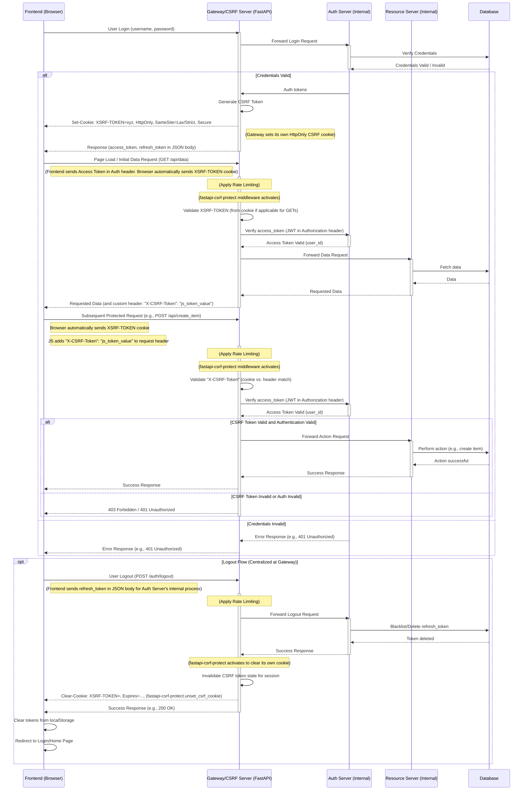

# Build Principles

## Servers

- Gateway Server
  - Does CSRF
  - Request forwarding
  - Does Rate Limiting (TODO)
- 2 servers (auth port 5001 and resource (main one) port 5000)
  - Auth server acts as a proxy for the resources server. Frontend only sees the resources server. Any requests that require auth are proxied to the auth server.
  - Auth server implements OAuth2 protocol to allow third-party apps to access the resources server with limited access granted by the user.
  - Auth server is stateless, and doesn't store any user data.

## Common Coding Principles

- common virtual environment
- Most operations are async
- Shared user \_id passed in token for cross-server consistency
- keep backend codebase clean
  - no python file gets longer than 750 lines
  - no function gets longer than 75 lines
  - add logging everywhere
  - ideally, the code should be self-explanatory, but still have comments
  - no use of `global` or `print`
  - no unused imports
- Ocassionally search python.analysis.typeCheckingMode in VSCode and enale to look up potential errors

## API

- RESTful API used for all operations.
- Keep versions and backwards compatibility in mind.

Standard responses:

```json
{
  "success": true,
  "message": "Post created successfully", // some simple message
  "data": {
    // all the data you want to return, changes based on the request
    "post_id": "abcd1234",
    "title": "Midnight Chai",
    "created_at": "2025-06-23T15:35:00Z"
  }
  // "timestamp": "2025-06-23T15:35:00Z" // optional
}
```

error responses:

```json
{
  "success": false,
  "message": "User not found", // explanation of the error
  "error": {
    // more details about the error, optional
    "code": "FIELD_MISSING", // error code, used by the frontend to show the right error message
    "details": "Missing field 'email'." // explanation of the error
  }
  // "timestamp": "2025-06-23T15:30:00Z" //datetime.utcnow().isoformat()
}
```

- JWT passed as Authorization: Bearer <token> header in secured routes

### why API versioning is necessary

1. **Clients other than your Frontend** may emerge (mobile app, partner apps, CLI tools, toaster, fridge).
2. **Long-lived requests** (like queued jobs or pre-signed URLs) might break if you roll out changes unversioned.
3. **Rolling deploys** = your infra might briefly have two Frontend versions (old & new) in parallel.
4. **Debugging**: when something breaks, you'll want to know _which version_ of the API it came from.
5. **Graceful deprecation**: versioning lets you phase things out without nuking everyone at once.

## Authentication

- OAuth2 protocol
  - Implemented JWT (signed w/ HS256) access token and refresh token
  - Both are set `SameSite=Strict` cookies
  - Tokens validated with type, sub, and exp checks
- CSRF via `fastapi-csrf-protect`.
  - managed by gateway server
  - Actually not quite necessary, but good to have
  - Checked for every request
- Passwords hashed using bcrypt via passlib
- Only store hashed passwords in DB



## Deletion

- We believe in soft deletion. but that is a pain to implement.
- on deletion, delete personal identifying information (PII) like username and email after a set period of time (e.g., 6 months).

## Database

- NoSQL (port 27017)
- Try to keep it modular, tiny collections
- Each server has its own collection in a shared database to later be split into separate databases
- make sure to use transactions for multi query operations.

## Frontend

- Pure vibe coding. (port 3000)
- Currently NextJS, maybe switch to Vite + React
- SPA (single page app)
- Use any copyrighted images, fonts, etc.

## Testing

- Swagger UI (http://localhost:5000/docs) to test APIs.
- Before making pages, make static html (project/backend/static/index.html) to test the backend.
- Locust (/backend/test/locust_test.py) for load testing. (port 8089)

## Networking

- reverse proxy used to host the frontend and backend on the same domain.
- cloudflared used to open the app to the internet. never ngrok.

## Git

- do whatever, just dont push to main

## Future Add-ons

- User scopes/roles (admin, mod, etc.) for granular access control
- Email & phone verification (via OTP)
- all flow is via http/https (no WebSockets Secure (wss) for now) might need for voice/video calls
  - but when you add wss, just slot it as a dedicated realtime service (keep it isolated!)
- Sanitize all user input (e.g., prevent XSS)
